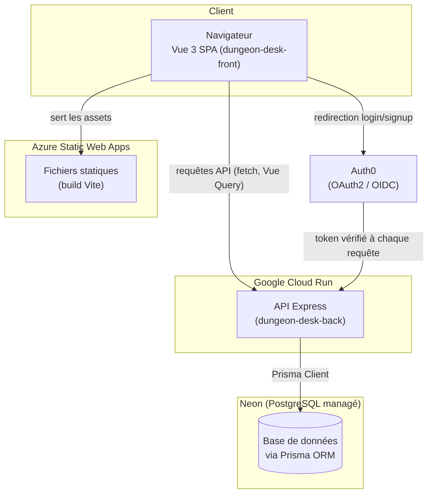

# Architecture logicielle

## Vue d'ensemble



Deux dépôts Git indépendants (`dungeon-desk-front`, `dungeon-desk-back`),
déployés séparément, communiquant uniquement par HTTP (API REST + OpenAPI).
Aucun code partagé entre les deux — le contrat d'API (voir plus bas) est la
seule interface commune.

## Frontend (`dungeon-desk-front`)

SPA Vue 3 servie en statique depuis Azure Static Web Apps (voir
[protocole-cicd.md](./protocole-cicd.md)). Structure de `src/` :

| Dossier | Rôle |
|---|---|
| `views/` | Une vue par route (`HomeView.vue`, `CharacterCreator.vue`, `SortsListView.vue`...) |
| `components/` | Composants réutilisables, avec un sous-dossier dédié `CreateCharacterSteps/` (9 étapes + leurs modales de détail) |
| `stores/` | État global Pinia — 4 stores : `app.ts`, `auth.ts`, `character.ts`, `npc.ts` |
| `composables/` | Logique réutilisable hors état global (`useDiceRoller.ts`, `useTutorial.ts`...) |
| `utils/` | Fonctions pures (traductions, calculs de coût de caractéristiques, chargement de données SRD) |
| `api/generated/` | Client HTTP + types générés par Orval (voir plus bas) — **jamais modifié à la main** |
| `router/` | Déclaration des routes (`src/router/index.ts`) |
| `types/` | Types partagés (`Character`, mapping API ↔ modèle applicatif) |

## Backend (`dungeon-desk-back`)

API Express déployée en conteneur sur Cloud Run. Séparation en couches
inspirée du pattern MVC (détaillée dans
[frameworks-paradigmes.md](./frameworks-paradigmes.md)) :

```
src/
├── routes/         # déclaration des endpoints + doc Swagger inline
├── controllers/     # logique métier par ressource (character, npc, auth)
├── validators/       # schémas Zod (entrée validée avant d'atteindre le contrôleur)
├── middleware/        # protect (Auth0), validateIdParam
├── utils/               # logger (Winston), monitoring (Prometheus)
└── swagger/              # génération de la spec OpenAPI
```

Chaque route passe par : `middleware` (authentification/validation légère)
→ `controller` (logique + accès Prisma) → réponse JSON. Les schémas Zod sont
dans des fichiers séparés des contrôleurs, réutilisables indépendamment
(ex. `updateCharacterSchema` réutilise `createCharacterSchema` plutôt que de
dupliquer les règles — voir `src/validators/characterValidator.ts`).

## Base de données

PostgreSQL managé (Neon), accédé exclusivement via Prisma. Trois modèles
(`prisma/schema.prisma`) : `User`, `Character`, `Npc`. Les données
spécifiques à un personnage (race, classe, caractéristiques, choix de
création...) sont stockées en JSON dans la colonne `data` de `Character`,
avec `name`/`level`/`race`/`class` dupliqués en colonnes propres pour les
requêtes/affichages simples (liste des personnages sans devoir parser le
JSON).

## Ce qui favorise la maintenabilité

- **Typage TypeScript de bout en bout**, front et back, avec `strict` activé
  côté build (`vue-tsc --build` / `tsc --noEmit` bloquent la CI, voir
  [criteres-qualite-performance.md](./criteres-qualite-performance.md)).
- **Contrat d'API comme source unique de vérité** : le backend expose sa
  spec OpenAPI (`swagger-jsdoc`, exposée sur `/openapi.json` et `/api-docs`),
  et **Orval génère automatiquement** le client HTTP + les types + les hooks
  Vue Query côté frontend à partir de cette spec
  (`orval.config.ts` : `target: 'http://localhost:3000/openapi.json'`,
  sortie dans `src/api/generated/`). Le frontend ne peut pas diverger
  silencieusement du contrat backend sans régénération explicite
  (`npm run generate:api`).
- **Validation centralisée côté back** (Zod) séparée des contrôleurs,
  réutilisable et testable indépendamment.
- **Séparation claire des responsabilités** : les composants du créateur de
  personnage ne parlent jamais directement à `fetch`/Prisma — ils passent
  par les stores Pinia, eux-mêmes générés/typés via Orval.

## Limites connues (assumées, pas cachées)

- **Double système d'authentification non nettoyé** : JWT interne
  (bcrypt) et Auth0 coexistent côté backend, alors que le frontend
  n'utilise plus que Auth0. Détail dans
  [securite.md](./securite.md).
- **Duplication du chemin d'écriture des personnages, découverte en
  rédigeant ce document** : `CharacterCreator.vue` utilise **deux stores
  différents** pour un même personnage — `useCharacterStore` (`stores/character.ts`)
  pour la lecture (`fetchCharacter`, ligne 124), et `useAppStore`
  (`stores/app.ts`) pour l'écriture (`store.createCharacter`/
  `store.updateCharacter`, lignes 268 et 271). Les deux stores maintiennent
  chacun leur propre liste locale de personnages (`characters.value`),
  sans synchronisation entre eux. Conséquence concrète : les méthodes
  `saveCharacter`/`updateCharacter` de `character.ts`, couvertes par des
  tests unitaires (`characterStore.spec.ts`, voir
  [cahier-de-recette.md](./cahier-de-recette.md)), **ne sont appelées par
  aucun composant** — le vrai chemin de sauvegarde passe par `app.ts`, non
  testé. C'est un vrai constat de dette technique à traiter (fusionner les
  deux stores ou clarifier leurs responsabilités respectives), pas une
  fonctionnalité cassée : `app.ts` appelle bien la même API réelle.
- **`app.ts` contient aussi des entités non branchées à l'API**
  (`campaigns`, `quests` — `createCampaign`, `createQuest`) qui semblent
  correspondre à des fonctionnalités prévues mais non exposées dans
  l'interface actuelle (aucune vue ne les utilise, vérifié par recherche
  dans `src/`).
